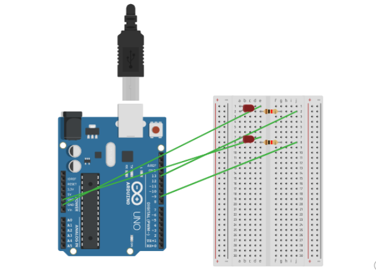
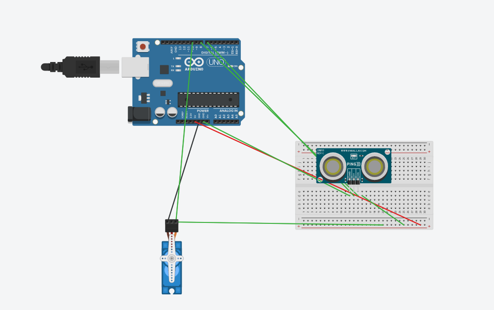
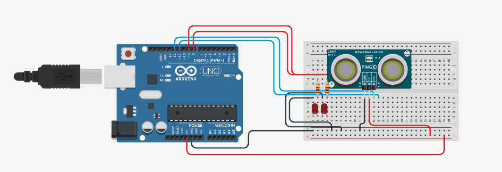
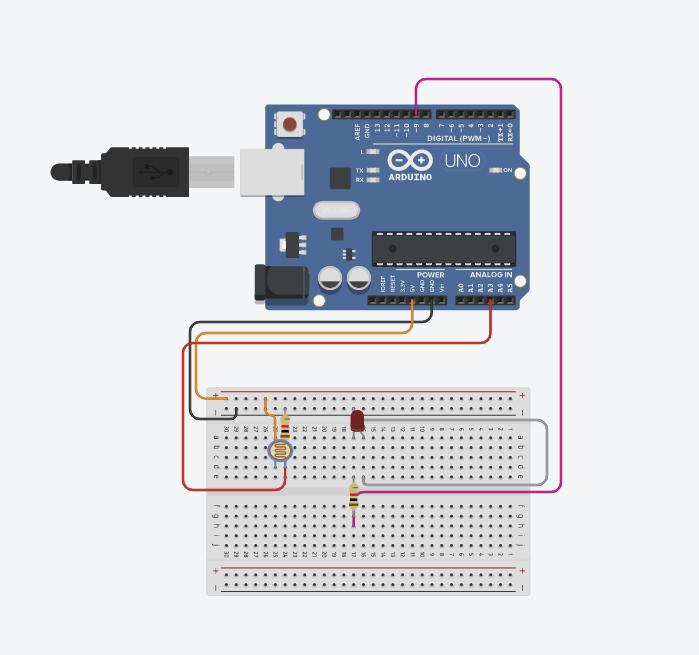

# Basic_arduino

## LED blink revisited

Makes an LED fade in an out

### code

```C++

int led = 9;        
int brightness = 0; 
int fadeAmount = 5;


void setup() {

  pinMode(led, OUTPUT);
}


void loop() {

  analogWrite(led, brightness);


  brightness = brightness + fadeAmount;

  
  if (brightness <= 0 || brightness >= 255) {
    fadeAmount = -fadeAmount;
  }

  delay(10);
}


```

### Wiring


### Reflection
 At the beginning it was easy until I reached the spicy part to make the LED fade in and out. I read through a couple forums to find the righttype of thing to use then it was just trial and error.


## finite LED blinker

make one LED blink 5 times then switch to another LED to blink 5 times then stop

### code

```c++
/*

*/
int ledPin = 9;
int maxnum = 5;
int counter = 0;
void setup() {

  pinMode(13, OUTPUT);
  pinMode(9, OUTPUT);
}

void loop()
{
  if (counter < maxnum) {
    digitalWrite(13, HIGH);

    delay(250);

    digitalWrite(13, LOW);

    delay(250);

    counter++;
  } else if (counter < (maxnum * 2)) {
    digitalWrite(9, HIGH);

    delay(250);

    digitalWrite(9, LOW);

    delay(250);

    counter++;
  } else {
  counter=0;
  }
}


```

### wiring




### reflection

This one was much more difficult then the last one because of I didnt really understand how code works at first then I got it explained to me so after a bit of problem solving I finally got it.


## hello functions

make a dstance calculator then ahve a servo turn a certain amount depending on the distance


### code


```c++
#define echoPin 7
#define trigPin 8
#include <Servo.h>
long duration;
long distance;
Servo myServo;
void setup() {
  Serial.begin(9600);
  pinMode(echoPin, INPUT);
  pinMode(trigPin, OUTPUT);
  myServo.attach(10);
}

void loop() {


  Serial.println(getDistance());

  delay(500);

  if (getDistance() > 10 ) {
    myServo.write(75);
    delay(500);

  }
  else {
    fastServo();
    delay(500);
  }

}

int getDistance() {
  digitalWrite(trigPin, LOW)  ;
  delayMicroseconds(2);

  digitalWrite(trigPin, HIGH);
  delayMicroseconds(10);

  digitalWrite(trigPin, LOW);

  duration = pulseIn(echoPin, HIGH);

  distance = duration / 58.2;
  return distance;
}
void fastServo() {
  myServo.write(180);
}
```
### wiring



### reflection

I made the distance calculator pretty quickly, the main problem was getting the servo to turn with functions based on the distance. I spoent a long time figuring out where to put the wires as well as how to make the servo work with the sensor. I had to ask for help many times but I got it finally after a lot of frustration.


## newPing

do something using the newPing library


## code


```C++
#include <NewPing.h>

#define TRIGGER_PIN 12
#define ECHO_PIN 11
#define MAX_DISTANCE 200
int ledPin = 9;
NewPing myHC_SR04(TRIGGER_PIN, ECHO_PIN, MAX_DISTANCE);

void setup() {
  Serial.begin(9600);

  pinMode(9, OUTPUT);
  pinMode(8, OUTPUT);
  pinMode(ECHO_PIN, INPUT);
  pinMode(TRIGGER_PIN, OUTPUT);
}

void loop() {

  Serial.println(myHC_SR04.ping_cm());

  delay(100);

  if (myHC_SR04.ping_cm() > 15 ) {

    digitalWrite(9, HIGH);

    delay(250);

    digitalWrite(9, LOW);

    delay(50);

  }
  else {
    digitalWrite(9, LOW);

  }
  
  if (myHC_SR04.ping_cm() < 15 ) {
    digitalWrite(8, HIGH);

    delay(250);

    digitalWrite(8, LOW);

    delay(50);

  }
  else{
    digitalWrite(9, LOW);
  }
}
```
### wiring




### reflection

This was very easy, all I had to do was put in old led code that I use for the led blink project and then it was good to go


## Photoresistor 

Make a nightlight that turns on when it gets dark

## code

```c++

int pResistor = A3; 
int ledPin=9;  


int val = 0;			

void setup(){
 pinMode(9, OUTPUT);  
 pinMode(pResistor, INPUT);
 Serial.begin(9600);
}

void loop(){

  val = analogRead(pResistor);
  Serial.println(val);
  delay(50);
  if (val < 15){
    digitalWrite(9, HIGH); 
  }
  else{
    digitalWrite(9, LOW); 
  }

  delay(200); 

}

```

### wiring



### reflection

This one was actually pretty easy. I used code from my 5 blink project to make the LED turn on and off with certain variables and add the photo resistor code.
