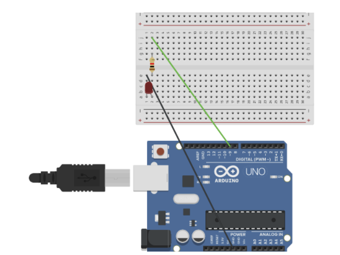

# Basic_arduino

## LED blink revisited

Makes an LED fade in an out

### code

```C++

int led = 9;        
int brightness = 0; 
int fadeAmount = 5;


void setup() {

  pinMode(led, OUTPUT);
}


void loop() {

  analogWrite(led, brightness);


  brightness = brightness + fadeAmount;

  
  if (brightness <= 0 || brightness >= 255) {
    fadeAmount = -fadeAmount;
  }

  delay(10);
}


```

### Wiring


### Reflection
